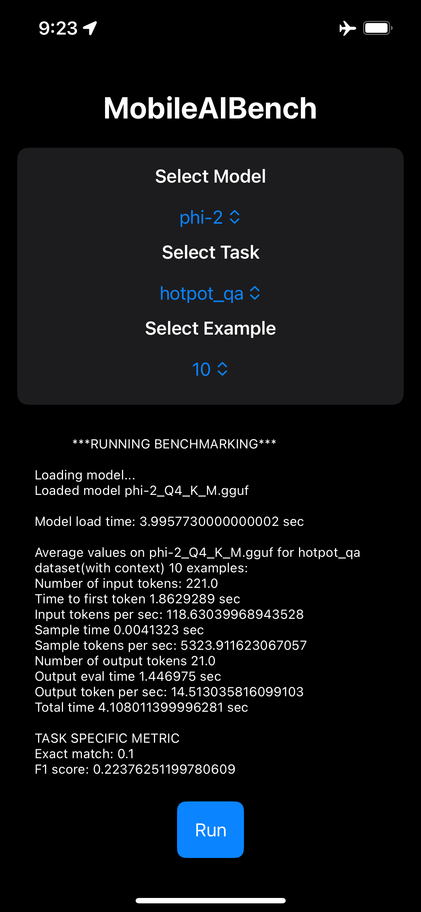
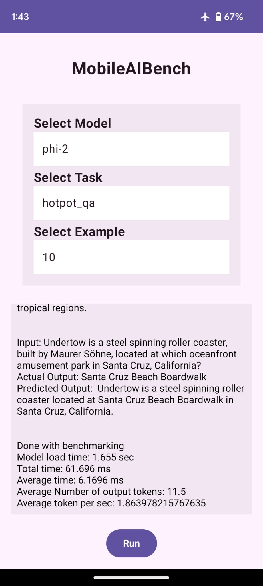

<div align="center">
  <a href="https://github.com/SalesforceAIResearch/MobileAIBench"></a>
</div>

<div align="center">
    
  
  
</div>


---

## MobileAIBench

A comprehensive benchmark designed to evaluate the performance and resource consumptions of LLMs & LMMs for on-device use cases.


## Installation

To install MobileBench, follow these steps:

1. Clone the Repository:
   ```shell
   git clone --recurse-submodules https://github.com/SalesforceAIResearch/MobileAIBench.git
   ```
2. Create a Conda Environment:
   ```shell
   conda create -n mobile_bench python=3.10
   conda activate mobile_bench
   ```
3. Run the Makefile:
   ```shell
   make
   ```
4. Add OpenAI API Key:
   ```shell
   export OPENAI_API_KEY=<OPENAI_API_KEY>
   ```

## Usage

Here are some usage examples for running MobileAIBench:

### Task: Question Answering

- **Dataset:** hotpot_qa & databricks-15k
- **Model:** xgen2-3b.gguf

- Run on GPU:
    ```bash
    python ./src/mobile_bench.py --task question_answering --model_lib llama_cpp_python --model_name xgen2-3b.gguf --use_gpu
    ```
- Run on CPU:
    ```bash
    python ./src/mobile_bench.py --task question_answering --model_lib llama_cpp_python --model_name xgen2-3b.gguf
    ```

### Task: All (Standard_NLP and Trust & Safety)

- **Model:** xgen2-3b.gguf

- Run on GPU:
    ```bash
    python ./src/mobile_bench.py --task all --model_lib llama_cpp_python --model_name xgen2-3b.gguf --use_gpu
    ```
- Run on CPU:
    ```bash
    python ./src/mobile_bench.py --task all --model_lib llama_cpp_python --model_name xgen2-3b.gguf
    ```
## Running Mobile App
- To run ios mobile app, refer to ./ios-app/README.md
- Here's a screenshot taken from the ios-app
<div align="center">
   
</div>
- To run android mobile app, refer to ./android-app/README.md
- Here's a screenshot taken from the android-app
<div align="center">
   
</div>

